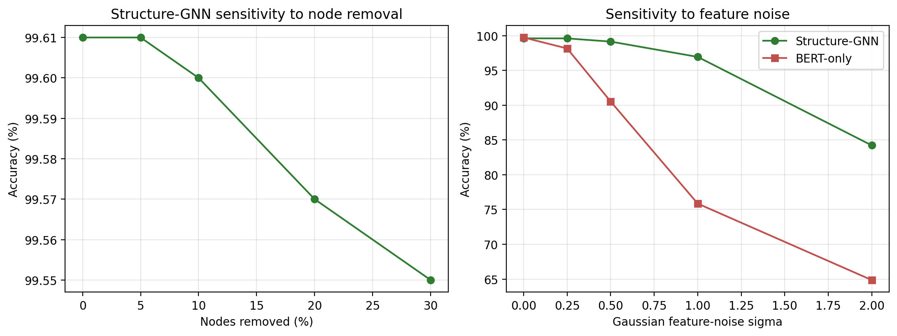

# Robustness test 1: sensitivity analysis

Prediction stability under (A) random removal of graph nodes (extending the dissertation's single 10% analysis to a sweep) and (B) Gaussian noise added to the input features of both models. Flip rate is the fraction of the 9,276 test predictions that change from the clean prediction; lower is more robust.

## (A) Structure-GNN, node removal

| Nodes removed | Flip rate (%) | Accuracy (%) |
|---|---|---|
| 0 | 0.00 | 99.61 |
| 5 | 0.00 | 99.61 |
| 10 | 0.03 | 99.60 |
| 20 | 0.09 | 99.57 |
| 30 | 0.15 | 99.55 |

## (B) Feature-noise, both models

| Noise sigma | Structure-GNN flip (%) | BERT-only flip (%) |
|---|---|---|
| 0.0 | 0.00 | 0.00 |
| 0.25 | 0.10 | 1.67 |
| 0.5 | 0.65 | 9.47 |
| 1.0 | 2.93 | 24.05 |
| 2.0 | 15.67 | 35.13 |

Reproduce with `python robustness_1_sensitivity.py`.
